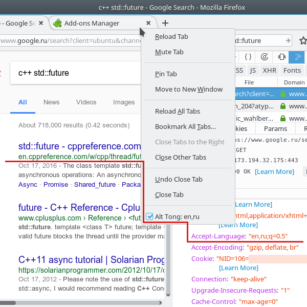
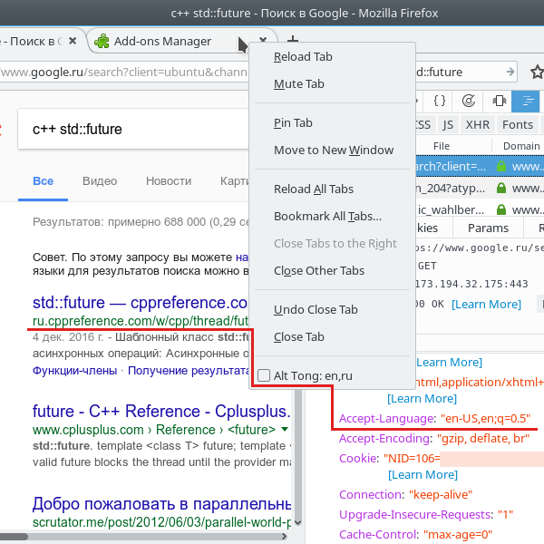

# Alt Tong extension for Firefox

 Install from [addons.mozilla.org](https://addons.mozilla.org/en-US/firefox/addon/alt-tong/).

Helps e.g. if search results depend on languages settings
of the browser. Some topics may be better covered in
native tongue, for other ones English is preferred due to
more relevant result and more complete information.
Works by overwriting of "Accept-Language" HTTP header
in outgoing requests.

At first, configure alternative rank of languages on the
`about:addons` page.
Now it is possible to promptly turn it on and off
through context menu for tabs (right click on tab label).
It seems that more than one language should be set in proper order
to convince the server what you really want.
Default language list can be  configured at
`about:preferences#content`
or by `intl.accept_languages` setting in the `about:config` page.

## Motivation

Some sites have content in more than one language. For example
I prefer to read http://cppreference.com/ and https://developer.mozilla.org/
in English expecting more complete description and less typos.
Google may decide to present search results with links to
the pages written in Russian. I notice that single language in browser
preferences may be ignored perhaps with fallback to guess by geoip.
Permanently put English at the top is not an option since other
sites may pretend to be clever by switching to incomplete partially
translated or severely obsolete version instead of rich and fresh native pages.
It is not awfully convenient to move English to the top place
and later back in browser settings. It requires too many clicks,
it is easy to forget to revert changes in languages order.

I found a fairly simple add-on
[Quick Accept-Language Switcher](https://addons.mozilla.org/en-US/firefox/addon/quick-accept-language-switc/)
written by Dan Callahan. It does the trick, but I have a bit different
point of view concerning the ideal behavior of such extension.

Features of this extension:

* Persistent preferences.
* Does not consume space of browser toolbar.
  It is intentionally, even though interface becomes hidden.
* Request interceptor is set only if alternative accept language
  option is turned on.

## Notes

It does not work on Android due to Firefox for Android supports
neither
[`options_ui`](https://developer.mozilla.org/en-US/Add-ons/WebExtensions/manifest.json/options_ui)/[`chrome.runtime.openOptionsPage()`](https://developer.mozilla.org/en-US/Add-ons/WebExtensions/API/runtime/openOptionsPage)
nor [`chrome.contextMenus`](https://developer.mozilla.org/en-US/Add-ons/WebExtensions/API/contextMenus).

## See also

1. [RFC 3282 "Content Language Headers"](https://tools.ietf.org/html/rfc3282)
for exact format of "Accept-Language" header value.

2. [MDN wiki page for Accept-Language](https://developer.mozilla.org/en-US/docs/Web/HTTP/Headers/Accept-Language)

## License

This Source Code Form is subject to the terms of the Mozilla Public
License, v. 2.0. If a copy of the MPL was not distributed with this
file, You can obtain one at http://mozilla.org/MPL/2.0/.

Copyright (C) 2017 Max Nikulin
